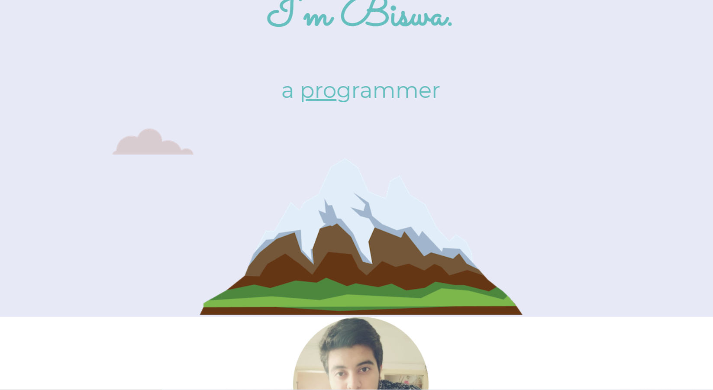

# MY-SITE :star_struck: :relieved: :sunglasses:

[](https://shields.io/) [](https://shields.io/) 

***This new Web page named 'My-Site' is created by Biswarup Bhattacharjee, student of BTECH, in University of Engineering and Management, Kolkata.***

**Email Id: bbiswa471@gmail.com.** 

**Contact No: 916290272740.** 


<p align="left">
<a href="https://www.facebook.com/profile.php?id=100070395300810" target="blank"></a>
<a href="https://instagram.com/biswarup2210" target="blank"></a>
<a href="https://github.com/biswa2210/biswa2210" target="blank"></a>
</p>

## About :point_down: 

This is a simple introductory page of BISWARUP BHATTACHARJEE made by himself. This page conveys my skills which are programming and liking spicy dishes. This page also contains some of my contact details like Facebook or GitHub account or email.

## MY WEBSITE DEMO VIDEO: :point_right: <a href="https://www.youtube.com/watch?v=AR8adLrAJbY&list=PL0lbDlMJ1h4hASHfEE-4cMS7CHRgtoxH5&index=2">Click here to watch</a>

## WEB DEV PLAYLIST: :point_right: <a href="https://www.youtube.com/watch?v=8_QAOpUdaIY&list=PL0lbDlMJ1h4hASHfEE-4cMS7CHRgtoxH5">Click here to watch</a>

## LINK : :point_right: https://biswa2210.github.io/my-site/

## Purpose :point_down:

I have made this to enlist my skills and by this page people can know my qualities.

## Importance :point_down:

 This page shows my skills and contact details. So, it is good way to get in touch with people.
 
## Folder Structure :point_down:

```bash
my-site
   ├── index.html
   ├── css
   |    └── style.css    
   └── images
         ├── chillies.png
         ├── cloud.png
         ├── computer.png
         ├── dp.png
         ├── favicon.ico
         └── mountain.png

```                  
## Making :point_down:

I have created this page using HTML5, CSS3.

## Screenshots :point_down: 

<div align="center">
<a href="my1.PNG"></a> <a href="my2.PNG"></a>

<a href="my1.PNG"></a>
</div>

